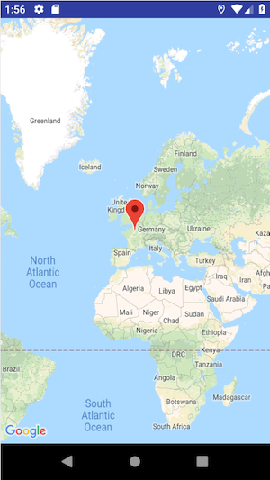
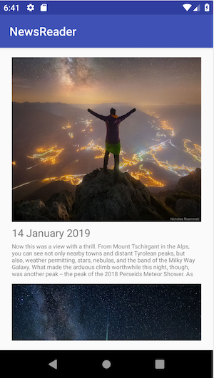

# L'union fait la force 
Le but de ce TP est de vous sensibiliser et de vous familiariser avec certaines notions de sécurité informatique.
Les pratiques que vous allez mettre en oeuvre ne sont autorisées que sur du matériel vous appartenant ou pour lequel
vous avez les autorisations écrites nécessaires émanant des autorités idoines.

**Article 323-1 du code pénal, Modifiée par LOI 2012-410 du 27 mars 2012 - art. 9}**

Le fait d'accéder ou de se maintenir, frauduleusement, dans tout ou partie d'un système de traitement automatisé de données est puni de deux ans d'emprisonnement et de 30000 euros d'amende.

Lorsqu'il en résulte soit la suppression ou la modification de données contenues dans le système, soit une altération du fonctionnement de ce système, la peine est de trois ans d'emprisonnement et de 45000 euros d'amende.

Lorsque les infractions prévues aux deux premiers alinéas ont été commises à l'encontre d'un système de traitement automatisée de données à caractère personnel mis en oeuvre par l'Etat, la peine est portée à cinq ans d'emprisonnement et à 75 000 euros d'amende.

## Consignes

### Rapport écrit

Afin d'évaluer correctement vos connaissances, il vous est demandé d'écrire et de rendre un rapport qui montre à l'enseignant votre compréhension du sujet.
Ce rapport doit fidèlement rendre compte de votre travail.
Vous y écrirez ce que vous comprenez de l'exercice, les différents problèmes que vous rencontrez et comment vous réussissez à les résoudre.
Ce rapport doit respecter les consignes suivantes:
- Le rapport est fichier `.md` (markdown) ou `.pdf` appelé `rapport_[nom_prénom]_[nom_prénom].md` (ou `rapport_[nom_prénom]_[nom_prénom].pdf`) que vous placerez dans le dossier correspondant au TD évalués (e.g `td3`) de votre répertoire git.
- Il vous est demandé d'expliquer les différentes étapes du TP et de montrer que vous les avez comprises.
- Dans certaines parties du TP, il vous est demandé de répondre à des questions théoriques. Vous répondrez à ces questions dans le rapport dans un français correct et en prenant soin de les numéroter.
- Seuls les rapports au format `.md` et `.pdf` seront pris en compte dans l'évaluation (attention à ne pas rendre votre rapport au format `.odt` ou `.doc`).
- Copier/coller des lignes de commande ou du code sans en expliquer leur fonctionnement n'aura aucune valeur dans l'évaluation de votre rapport.

### Code

Vous serez également évalué sur le code produit pendant le TD.
Les consignes suivantes sont à respecter :
- Le code produit doit pouvoir être compilé sur n'importe quelle machine qui possède l'environnement de développement standard (Android Studio dans le cadre de ce TP). Tout code qui ne compile pas sur la machine de l'enseignant ne sera pas pris en compte dans l'évaluation.
- Le code doit être clair et commenté.
- Pour chaque nouveau projet d'application Android, vous placerez le répertoire complet du projet (incluant les fichiers nécessaires à sa compilation) à dans le dossier portant le nom du TD courant (e.g `td1`) et vous lui donnerez un nom explicite tel que `td1_partie1_webview`.
- Avoir *Android Studio* ou *Intellij* installé sur sa machine.
- Vous prendrez soin de vérifier que votre application s'exécute correctement sur un émulateur qui possède les propriétés suivantes :
    - Device model: Pixel 2
    - Version de l'OS: Android 10 (Q, API 29), with Google Play
    - CPU architecture: x86
    
Il est de votre responsabilité de vérifier que l'application Android que vous développez est compatible avec la version d'Android et l'appareil mentionnés ci-dessus.
Toute application non fonctionnelle en raison de problèmes d'incompatibilité ne sera pas prise en compte dans la note finale du TP.

## Context

Pour cacher leurs comportements malicieux, les malwares ont souvent recourt à la technique dite d'`application collusion`.
Cette technique consiste à faire collaborer deux applications ou plus dans le but d'accomplir des actions malicieuses qu'elles ne pourraient pas faire indépendamment.


## Objectif

Dans ce TP, il vous est demandé de mettre en oeuvre une attaque par *application collusion* sur un téléphone en développant deux applications distinctes avec des privilèges différents.

La première est une application qui traque la position GPS de l'utilisateur pour l'afficher à l'écran sur une carte.
Pour fonctionner cette applications n'utilise que les permissions liées à la localisation GPS de l'appareil.
La seconde application est une application de News qui va chercher les derniers articles publiés par la NASA et les affiche sur l'écran de l'utilisateur. Cette application n'a besoin que de la permission à accéder à Internet pour fonctionner correctement.
Pour réaliser l'attaque sur un téléphone, l'application de tracking doit discrètement envoyer les données GPS qu'elle collecte à l'application de News qui sera alors en charge d'envoyer ces données à un serveur pirate.

### Question
A l'aide d'un schéma et d'un paragraphe explicatif clair, rappelez le principe d'*application collusion* sur Android.
Vous prendrez soin de mettre en évidence les différentes notions qui permettent cette attaque.
Pour vous aider, vous pourrez illustrer votre explication avec l'exemple pratique mis en oeuvre dans ce TD.

## Partie I : Traquer la position GPS

Dans cette partie, vous devez concevoir une application Android qui relève la position GPS du téléphone toutes les 
minutes et met à jour un point sur une carte.
Cette application sera uniquement écrite à l'aide de **Java**.

* Créez une nouvelle application que vous nommerez `gpstracker` dans le répertoire `td7/gpstracker`.
* Ecrivez le code nécessaire qui permet d'afficher une activité contenant une carte ainsi qu'un point pointant sur la carte.
Vous pourrez vous aider de l'API Google Maps pour faire cette étape. [https://developers.google.com/maps/documentation/android-sdk/start](https://developers.google.com/maps/documentation/android-sdk/start)
* Ecrivez le code nécessaire pour mettre à jour la position GPS du téléphone en temps réel sur la carte affichée. Vous pouvez suivre la documentation suivante : [https://developer.android.com/training/location/retrieve-current.html#GetLocation](https://developer.android.com/training/location/retrieve-current.html#GetLocation)

 

## Partie II : Ecrire une application de News

Dans cette partie, vous devez concevoir une application Android qui affiche une liste des dernières photos postées par la NASA sur leur site.\
La Nasa offre plusieurs `api endpoints` qui permettent d'accéder à différents contenus.
Pour cela, vous pourrez utiliser l'API `api.nasa.gov` dont la documentation est disponible ici: [https://api.nasa.gov/index.html#getting-started](https://api.nasa.gov/index.html#getting-started).
Inscrivez vous sur le site et utilisez la clé API qui vous est fournie.

Pour le TP, vous utiliserez l'API *APOD* (Astronomy Picture Of the Day), qui offre une photo ainsi que sa description tous les jours.
Pour concevoir votre application de news, vous devrez avoir un fil d'actualité qui contient les photos de l'API sur plusieurs jours.

Vous développerez cette application uniquement en **Java**.

* Implémentez une classe qui permet de récupérer les photos postées par la NASA.
* Ecrivez le `Layout` ainsi que le code Java nécessaire pour afficher la liste de photos sous la forme suivante:

 
```
Image
Date
Description
```

__Bonus :__
* Ecrivez le code nécessaire pour charger de nouvelles photos lorsque l'utilisateur scroll vers le bas.


## Partie III : Collecter les données GPS de l'utilisateur

Dans cette partie, il vous est demandé de collecter les coordonnées GPS d'un téléphone sur un serveur distant toutes les minutes.
Pour cela, vous devez trouver le moyen de faire communiquer les deux applications implémentées précédemment.

<!--
Idéalement, le code permettant de communiquer avec le serveur pirate distant n'est pas contenu localement dans le 
package de l'application.
-->

* Dans l'applications GPS, écrivez le code nécessaire pour envoyer un *Intent* à une autre application à chaque fois 
que les coordonnées GPS sont mises à jour. L'*Intent* doit contenir deux champs tels que:

| Champ         | Type          |
| ------------- | ------------- |
| `lat`         | `double`      |
| `lng`         | `double`      |

* Dans l'application de News, écrivez le `BroadcastReceiver` qui permet de recevoir les *Intents* envoyés par l'application GPS.
* Pour chaque Intent reçu dans l'application news, écrivez le code *Java* nécessaire pour envoyer les coordonnées GPS au serveur pirate (implémenté lors du TD6) par le biais d'une requête `http`.

Spécifications de la requête:

| URL           | Method        | Body format        |
| ------------- | ------------- | ------------------ |
| `/location`   | `POST`        | `application/json` |

Voici la structure du message:
```json
{
	"imei": "string",
	"coordinates": {
			"lat": "double",
			"lng": "double"
		}
	
}
```
* Mettez à jour le code de votre serveur pirate créé lors du TD précédent pour être en mesure d'effectuer les actions suivantes:
	- Recevoir la requête HTTP `/location` des clients.
	- Parser correctement le corps de la requête.
	- Ajouter le contenu de la requête au fichier `location-{imei}.json` (ici `{imei}` correspond au numéro imei reçu
	dans le corps de la requête http).
